# Tugas Praktikum Pemrograman Web

#### 1. membuat dokumen HTML dengan nama file lab4_box.html

# 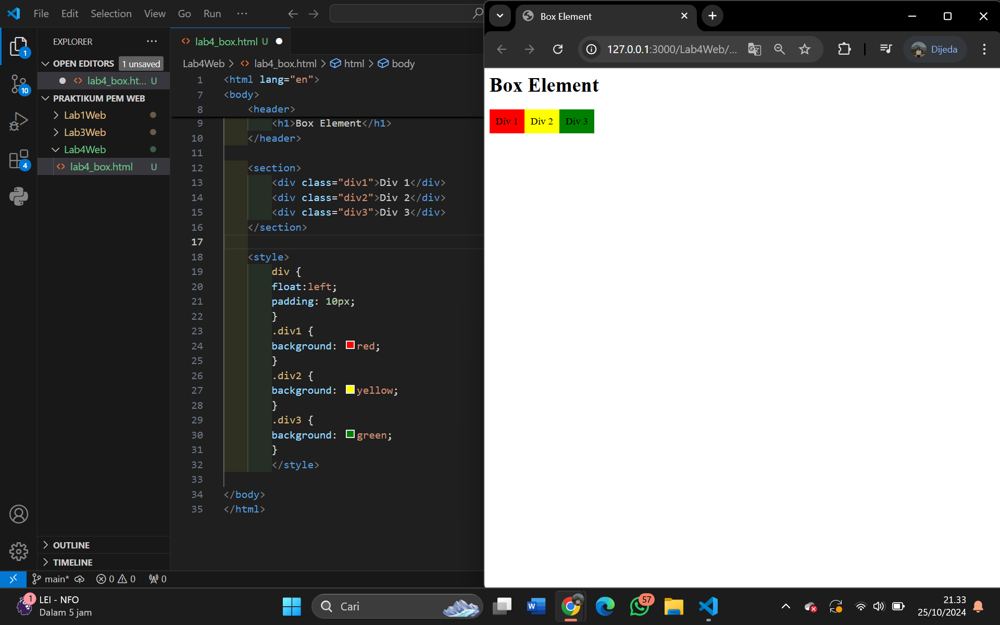

#### 2. Mengatur Clearfix Element

# 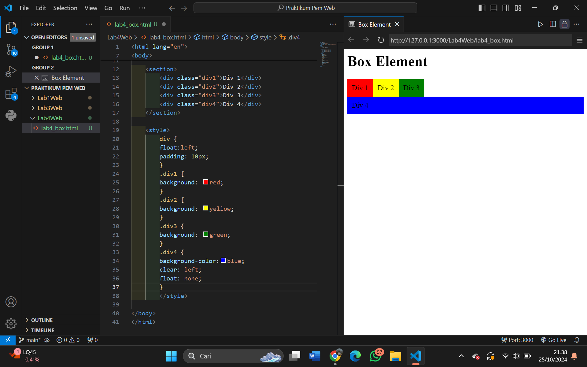

#### 3. eksperimen terhadap penggunaan property clear dengan nilai lainnya (left, both, right),

# 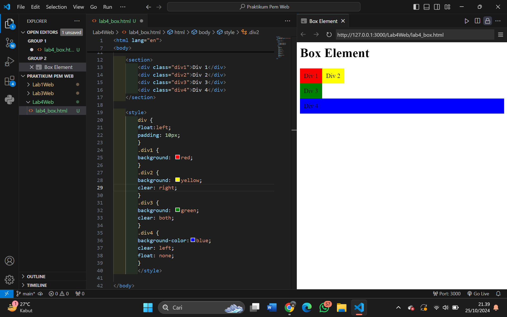

#### 4. Membuat Layout Sederhana dengan nama lab4_layout,

# 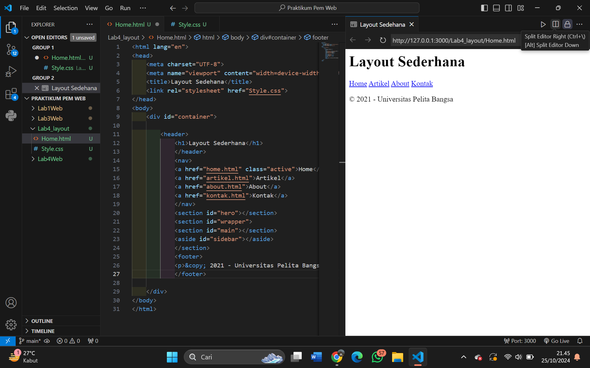

#### 5. Kemudian tambahkan kode CSS untuk membuat layoutnya.

# 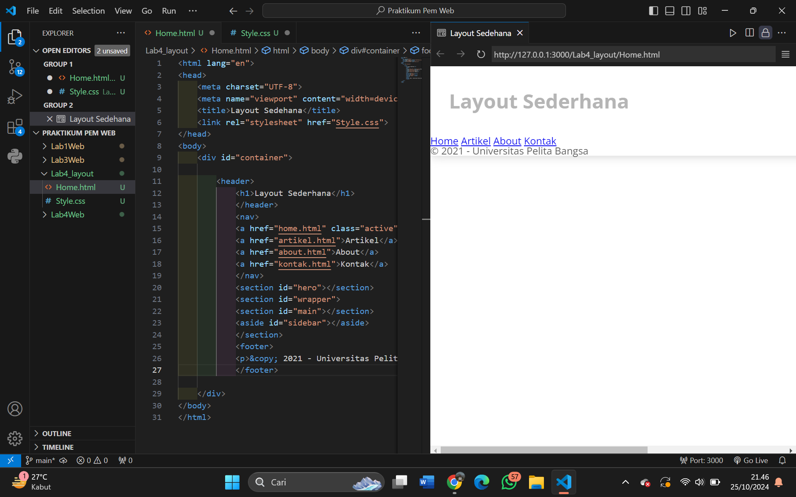

#### 6. Membuat Navigasi

# 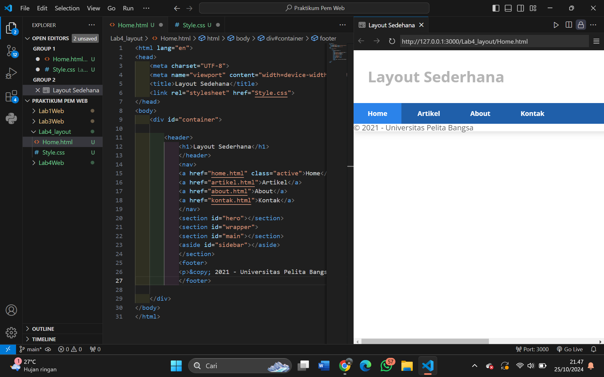 

#### 7. Membuat Hero Panel.

# 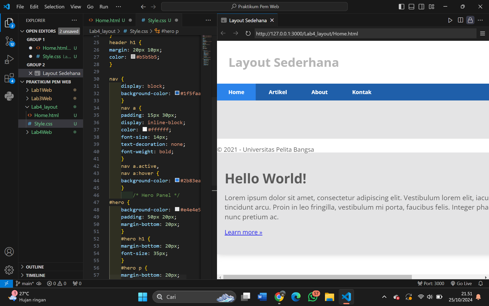

#### 8. Membuat Sidebar Widget

# 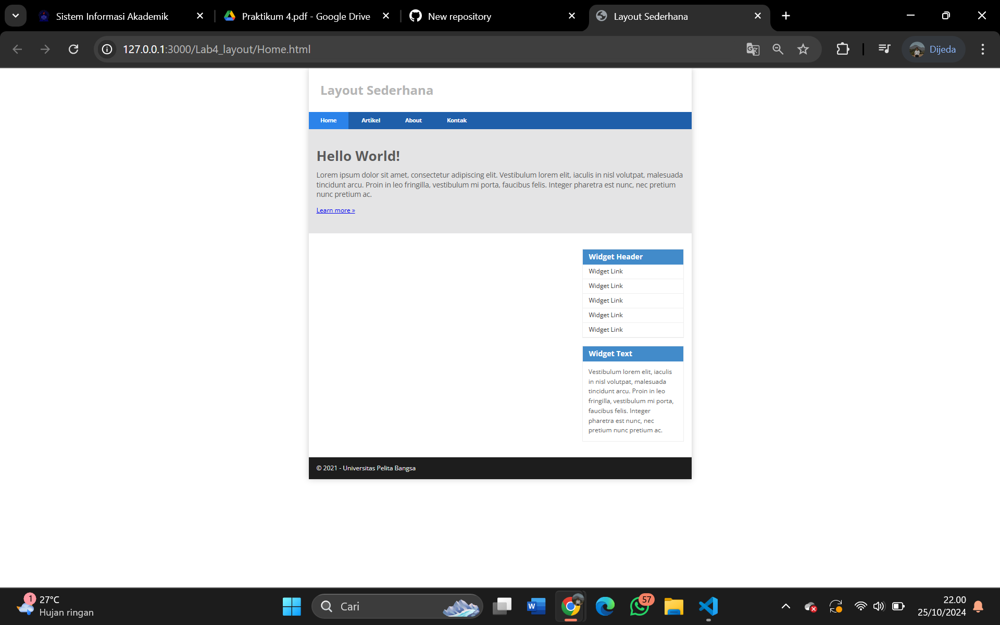

#### 9. Mengatur Footer

# 

#### 10. Mengatur Footer

# 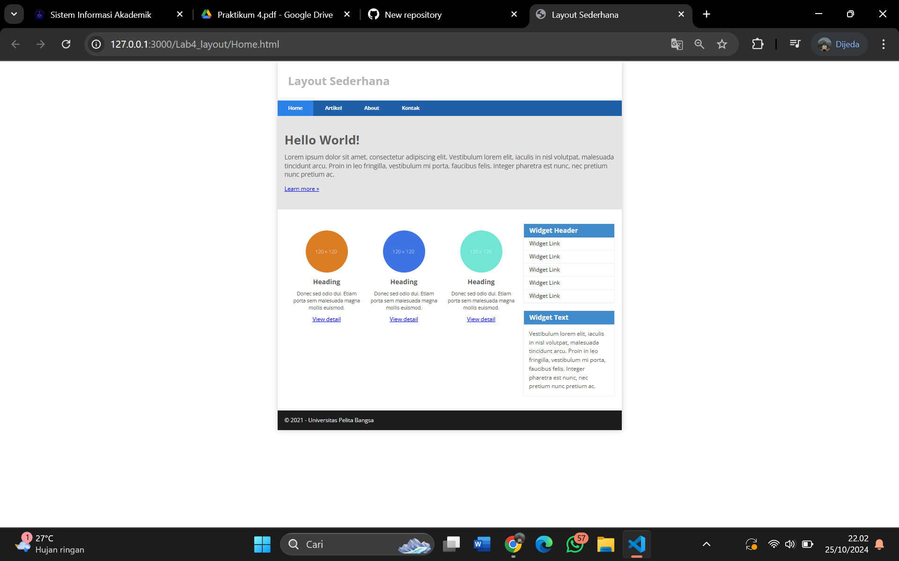

#### 11. Menambahkan Content Artikel

# 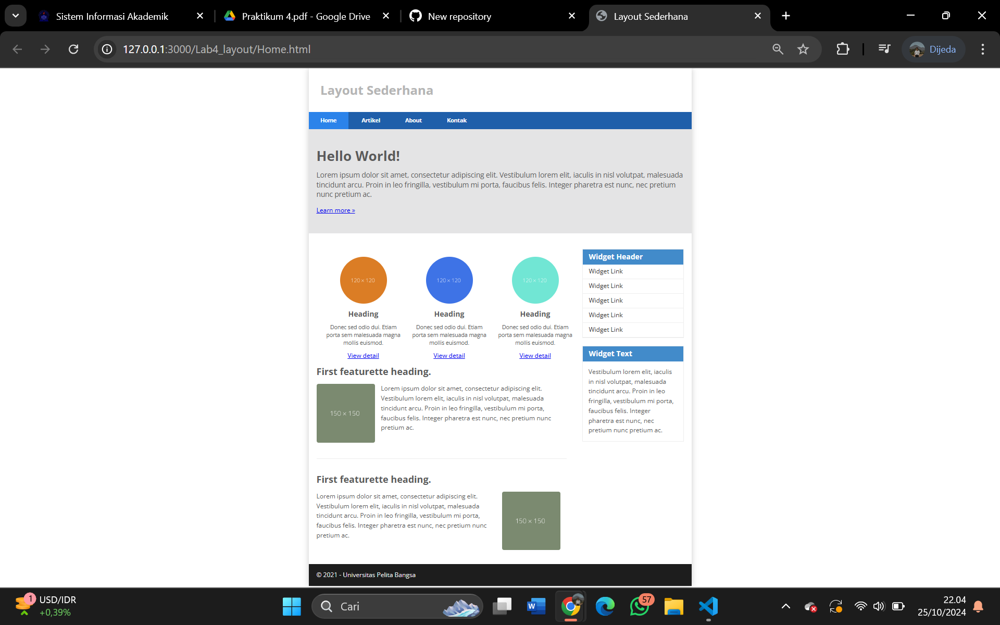

##  Pertanyaan dan Tugas
### 1. Tambahkan Layout untuk menu About => buat single layout yang berisi deskripsi, portfolio, dll
### 2. Tambahkan layout untuk menu Contact => yang berisi form isian: nama, email, message, dll

#### 1. Membuat Layout Menu About

# 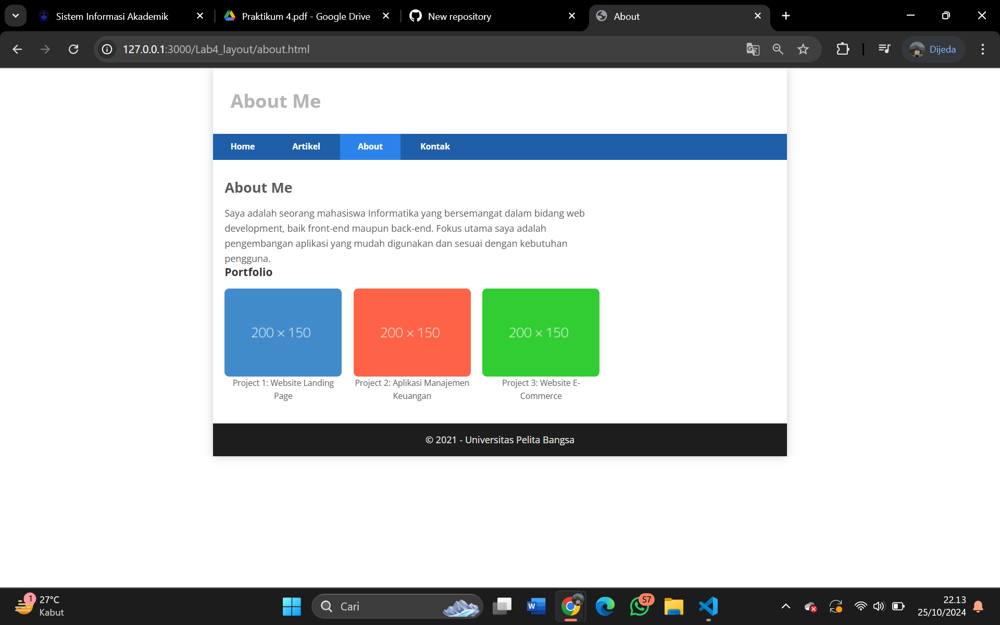

#### 2. Membuat Layout menu contact

# 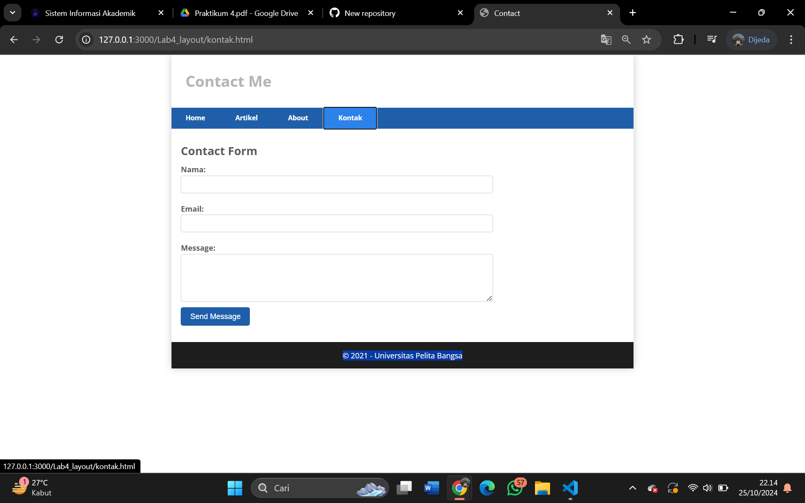
